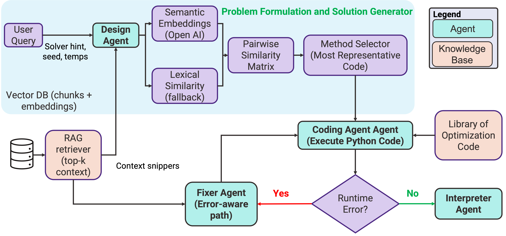

# A Multi-Agent Decision Intelligence System for Optimization under Uncertainty

This repository hosts an end-to-end decision intelligence environment for translating free-form engineering optimization problems into executable solvers with uncertainty awareness. Large Language Models (LLMs) act as coordinated agents that (1) interpret requirements, (2) synthesize candidate optimization code, (3) execute and auto-repair that code, and (4) summarize the solution together with epistemic uncertainty estimates.



*Design Copilot view illustrating how LLM agents collaborate with the Streamlit console, sandbox executor, and interpretation layer.*

## Key Capabilities
- **One-click Streamlit console** (`optimization_agent_streamlit_UQ_planning.py`) that orchestrates code generation, execution in a sandbox, automatic debugging, and natural-language interpretation.
- **Multi-sample uncertainty quantification**: generates multiple candidate solvers, computes similarity metrics (semantic or lexical), and surfaces epistemic uncertainty via mean similarity scores.
- **Self-healing execution loop**: failed runs trigger a fixer agent that patches the generated code while enforcing the RESULT contract and solver robustness requirements.
- **Interpretability-first outputs**: assumptions, solutions, solver metadata, and concise bullet summaries are collected so domain experts can audit model behavior.
- **Companion Jupyter notebook** (`llm_uncertainty_methods.ipynb`) showcasing four standalone techniques for quantifying LLM uncertainty in analytical workflows.

## Repository Contents
- `optimization_agent_streamlit_UQ_planning.py` – Streamlit application implementing the multi-agent pipeline (writer → executor → fixer → interpreter) with UQ controls.
- `llm_uncertainty_methods.ipynb` – Notebook demonstrating token log-probability bands, predictive entropy, self-consistency agreement, and semantic dispersion metrics.
- `optimization_resources/` – Reference material such as `engineering_design_optimization_martins_ning.pdf` to ground domain assumptions.
- `chroma/` – Placeholder for vector-store or cached embeddings if you extend the system with retrieval-augmented context.
- `LICENSE` – Usage terms for this project.

## Installation
1. Ensure Python 3.9+ is available.
2. (Recommended) Create and activate a virtual environment: `python -m venv .venv && source .venv/bin/activate`.
3. Install the core dependencies:
   ```bash
   pip install streamlit numpy scipy langchain-openai langchain-core python-dotenv openai pandas nbformat
   ```
   Add any other packages you plan to use (e.g., `pydantic`, `tiktoken`) as needed.

## Configuration
- Provide your OpenAI-compatible API key as an environment variable or via the Streamlit sidebar.
  ```bash
  export OPENAI_API_KEY="sk-..."
  export OPENAI_MODEL_NAME="gpt-5"   # Optional custom deployment alias
  ```
- The Streamlit UI exposes additional runtime controls such as sampling temperature, number of writer samples for UQ, embedding model name, solver preferences, and repair attempts.

## Running the Streamlit App
```bash
streamlit run optimization_agent_streamlit_UQ_planning.py
```
1. Describe the optimization problem in natural language.
2. Adjust sidebar controls (seed, solver preference, UQ settings).
3. Click **Solve** to trigger:
   - **CodeWriter**: generates `n_writer_samples` candidate solvers.
   - **UQ Engine**: computes similarity-based epistemic uncertainty and selects a medoid solver.
   - **Sandbox Executor**: runs the code with restricted builtins and captures stdout, assumptions, and RESULT.
   - **Auto-Fix Loop**: iteratively patches failures up to the configured repair attempts.
   - **Interpreter**: summarizes outcomes and highlights uncertainty metrics.

## LLM Uncertainty Notebook
Open `llm_uncertainty_methods.ipynb` in Jupyter or VS Code to explore four uncertainty estimators independent of the Streamlit app:
1. **Perplexity bands** derived from token log-probabilities.
2. **Predictive entropy** across the next-token distribution.
3. **Self-consistency agreement rates** from repeated samples.
4. **Semantic dispersion** using pairwise similarity matrices.

Each section includes runnable code with mocked data so you can plug in real LLM outputs later.

## Extending the System
- Swap or fine-tune prompts in the Streamlit app to target different solver behaviors (e.g., mixed-integer programming, stochastic optimization).
- Integrate retrieval-augmented context by populating `chroma/` and injecting document snippets before the writer agent.
- Add custom uncertainty estimators (e.g., Bayesian model averaging, conformal prediction) by reusing the `_semantic_similarity_matrix` and `_uq_from_matrix` utilities.

## License
This project is distributed under the terms outlined in `LICENSE`. Please review it before deploying or modifying the system.
